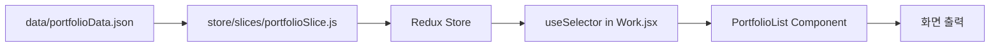

이 문서는 **React 포트폴리오 프로젝트**의 전체 구조와 작동 원리를 설명합니다.
 ---
## 🏗️ 1. 프로젝트 아키텍처 (Project Architecture)

이 프로젝트는 **Vite**를 기반으로 한 **React** 애플리케이션입니다. 주요 폴더 구조는 다음과 같습니다.

```text
react_project_20251217
├── .env                # 환경 변수 설정
├── index.html          # 앱의 진입점 (Entry Point) HTML
├── package.json        # 프로젝트 의존성 및 스크립트 관리
├── vite.config.js      # Vite 빌드 도구 설정
├── public/             # 정적 리소스 (이미지, 파비콘 등)
│   └── assets/images/  # 포트폴리오 및 UI 이미지
├── src/                # 소스 코드 메인 디렉토리
│   ├── main.jsx        # React 앱의 최상위 진입 파일
│   ├── App.jsx         # 라우팅 및 전역 레이아웃 설정
│   ├── index.css       # 전역 스타일 (Global CSS)
│   ├── components/     # 재사용 가능한 UI 컴포넌트
│   │   ├── layout/     # 헤더, 푸터 등 레이아웃 컴포넌트
│   │   ├── portfolio/  # 포트폴리오 관련 컴포넌트 (카드, 리스트)
│   │   └── ui/         # 버튼, 스크롤 등 작은 UI 요소
│   ├── pages/          # 라우트별 페이지 컴포넌트
│   │   ├── Home/       # 메인 페이지
│   │   ├── About/      # 소개 페이지
│   │   ├── Work/       # 작업물 목록 페이지
│   │   ├── Contact/    # 연락처 페이지
│   │   └── Detail/     # 프로젝트 상세 페이지
│   ├── data/           # 정적 데이터 파일 (JSON)
│   ├── store/          # Redux 상태 관리 (전역 상태)
│   ├── theme/          # 다크 모드/라이트 모드 테마 관리
│   ├── routes/         # 라우터 설정 파일
│   └── utils/          # 유틸리티 함수 (이미지 경로 처리 등)
```

---

## 📂 2. 폴더 및 파일 상세 역할 (Detailed Roles)

### **루트 디렉토리 (Root Directory)**
- **`index.html`**: 웹 브라우저가 가장 먼저 읽는 파일입니다. `<div id="root"></div>` 안에 React 앱이 그려집니다.
- **`vite.config.js`**: Vite 빌드 설정 파일로, 로컬 서버 실행 및 배포 빌드 방식을 정의합니다.
- **`package.json`**: 프로젝트에 설치된 라이브러리(`react`, `redux` 등) 목록과 실행 명령어(`scripts`)가 들어있습니다.

### **Src 디렉토리 (Source Code)**

#### **`src/main.jsx`**
- **역할**: React 앱을 DOM에 렌더링하는 시발점입니다.
- **주요 기능**:
    - `Redux Provider`: 전역 상태 관리 연결.
    - `ThemeProvider`: 다크 모드 테마 연결.
    - `Strict Mode`: 개발 모드 경고 활성화.

#### **`src/App.jsx`** & **`src/routes/AppRouter.jsx`**
- **역할**: 페이지 이동(라우팅)을 관리합니다.
- **구조**: `BrowserRouter`를 사용하여 URL에 따라 적절한 `pages/` 컴포넌트를 보여줍니다.
    - `/` -> `Home`
    - `/about` -> `About`
    - `/work` -> `Work`
    - `/portfolio/:id` -> `Detail` (동적 라우팅)

#### **`src/store/` (Redux Toolkit)**
- **역할**: 앱 전체에서 공유해야 하는 데이터를 관리합니다.
- **파일**:
    - `store.js`: 스토어 설정 파일.
    - `slices/portfolioSlice.js`: 포트폴리오 데이터, 필터링 상태 등을 관리하는 "조각(Slice)"입니다.

#### **`src/data/`**
- **역할**: 하드코딩된 데이터들을 관리하여 유지보수를 쉽게 합니다.
- **파일**:
    - `portfolioData.json`: 포트폴리오 프로젝트들의 정보(제목, 이미지, 설명 등)가 들어있는 JSON 파일입니다. 이곳에 데이터를 추가하면 자동으로 화면에 반영됩니다.

#### **`src/components/`**
- **역할**: 레고 블록처럼 재사용 가능한 UI 조각들입니다.
- **구분**:
    - `layout`: 모든 페이지에 공통으로 나오는 `Header`, `Footer`.
    - `portfolio`: `PortfolioCard`(개별 아이템), `PortfolioList`(목록).

---

## 🔄 3. 데이터 흐름 및 의존성 (Data Flow & Dependencies)

### **1. 애플리케이션 실행 흐름**
1. **`index.html`** 로드
2. **`main.jsx`** 실행 -> `store`, `theme` 초기화
3. **`App.jsx`** 실행 -> 라우터 로드
4. URL에 맞는 **`Page`** 컴포넌트 렌더링 (예: `Home.jsx`)

### **2. 포트폴리오 데이터 흐름 (Redux)**

- **설명**: `portfolioData.json`의 원본 데이터가 Redux Slice 초기값으로 설정되고, 컴포넌트들은 `useSelector`를 통해 이 데이터를 구독하여 화면에 표시합니다.

### **3. 테마(Dark Mode) 흐름**
```mermaid
graph TD
    Ctx[ThemeContext] --> Prov[ThemeProvider]
    Prov --> App[App Component]
    User[User Click Toggle] --> Hook[useTheme Hook]
    Hook --> Update[Theme State Update]
    Update --> Style[Apply html[data-theme]]
```
- **설명**: 사용자가 버튼을 클릭하면 `useTheme` 훅을 통해 컨텍스트 값을 변경하고, 이는 HTML 태그의 속성을 바꿔 전체 스타일을 실시간으로 변경합니다.

---

## 💡 4. 자주 묻는 질문 (FAQ for Beginners)

**Q. 새로운 포트폴리오를 추가하려면 어떻게 해야 하나요?**
A. 코드를 건드릴 필요 없이 `src/data/portfolioData.json` 파일에 양식에 맞춰 JSON 객체만 추가하면 자동으로 리스트와 상세 페이지에 반영됩니다.

**Q. 이미지는 어디에 넣나요?**
A. `public/assets/images/` 폴더에 이미지를 넣고, JSON 데이터에서 파일명만 지정해주면 됩니다.

**Q. 페이지 스타일을 수정하고 싶어요.**
A. 각 컴포넌트 폴더 안에 있는 `.css` 파일(예: `Header.css`)을 수정하거나, 전체 공통 스타일은 `src/index.css`를 수정하세요.